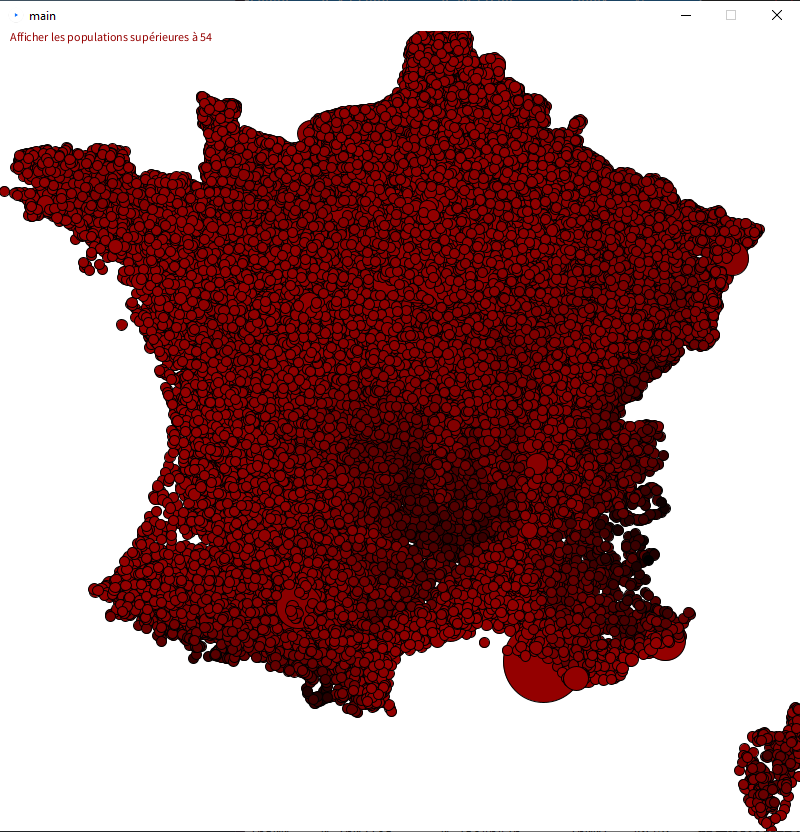
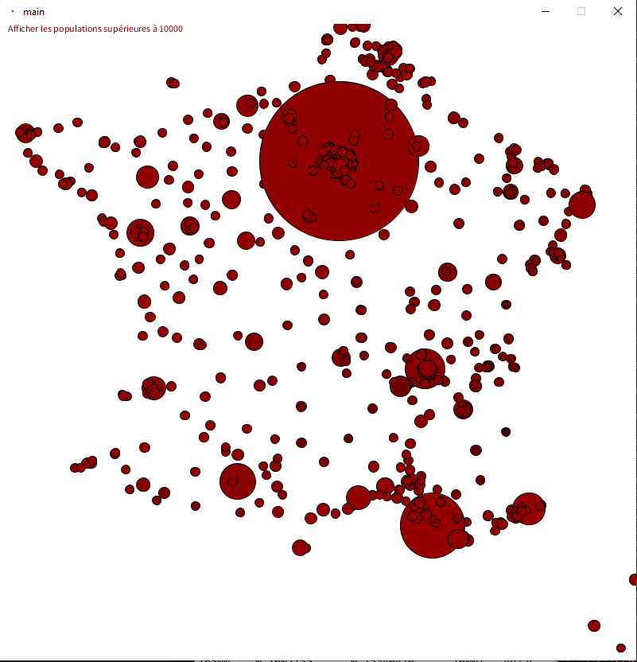
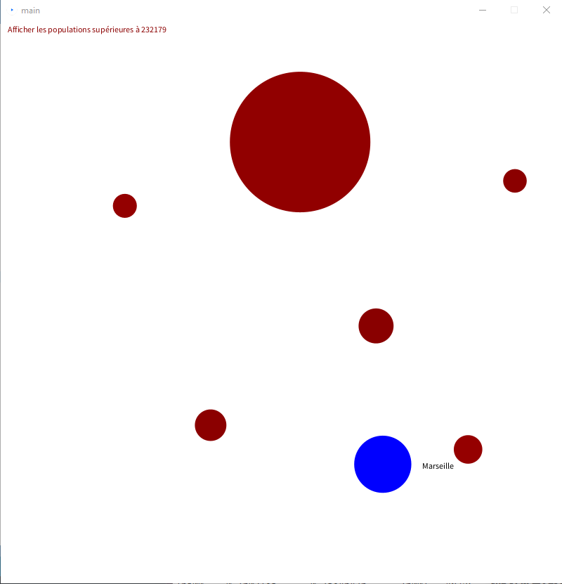
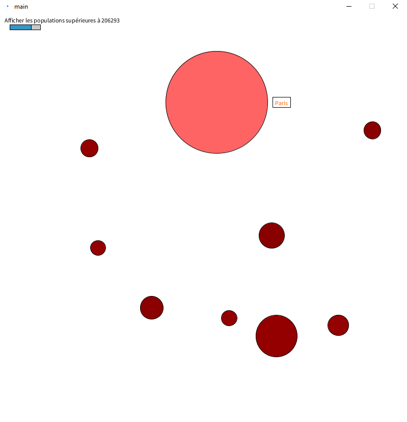

# TP3 : Visualisation de données

## Auteur
Florentin Bugnon / florentin.bugnon.etu@univ-lille.fr

## Partie 1 : Lire des données et les afficher à l'écran.

Cette partie a été réalisée avec succès. Voir le commit du même nom pour plus de détails.

## Partie 2 : Encoder de l'information avec des marques.

Cette partie a été réalisée avec succès. Voir le commit du même nom pour plus de détails.

Voici le résultat obtenu :

## Partie 3 : Interaction.

Cette partie a été réalisée avec succès jusqu'à la question 8 inclus. 

Il est possible d'afficher seulement certains villes en fonction de la population : 

Voici l'affichage lorsqu'on survole une ville :

Voici l'affichage lorsqu'on sélectionne une ville :

Le slider présent en haut à gauche permet de modifier la valeur de la population minimale pour afficher une ville. Il est réactif au clic mais pas au drag.